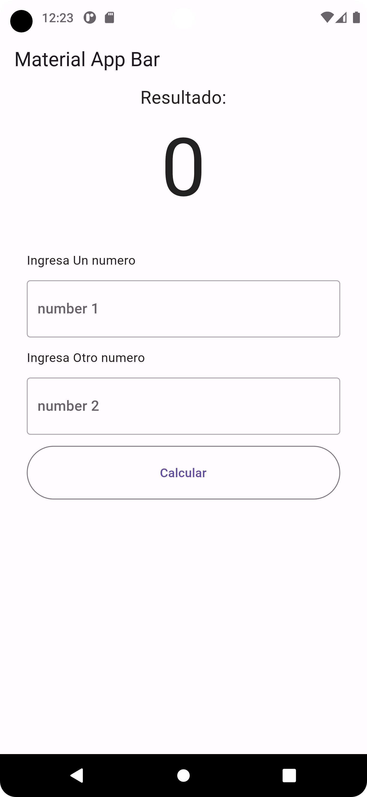
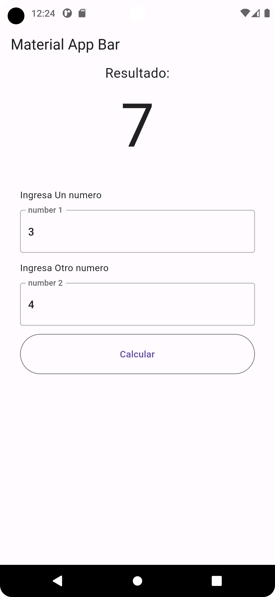

# sumadora de numeros

Este proyecto es un simple ejemplo realizado con flutter 
para sumar numeros mediante funciones , uso de texfields botones y manejo de excepciones.

> Todas las características del presente proyecto son de código abierto, y sirven netamente como ejemplos básicos de flutter.

 

El presente proyecto fue elaborado utilizando las librerías de material para Windows forms. todo el codigo esta escrito en c# y fue desarrollado en el framework .net framework

### Ayúdame  Crecer Como desarrollador sigueme en:

- [Twitter](https://twitter.com/diaz190799)
- [YouTube](https://www.youtube.com/channel/UC9G8JpXyUztKxAO7H6ZVbgA)
- [Linkedin](https://www.linkedin.com/in/joan-david-diaz-704121210/)
- [WebSite](https://davidiazdev.com/)
